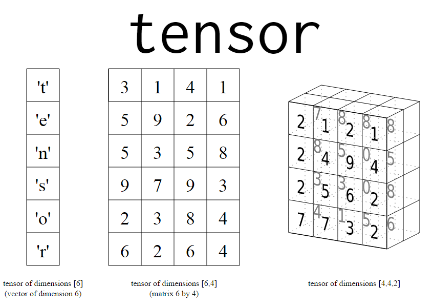

# 🐍 AI Deep Learning TensorFlow Python 🐍
🐍 **Deep Learning** with **TensorFlow** 🐍

Learning **AI Deep Learning** / **Machine Learning**. 
I tried to keep it as short as possible, but Truth needs to be told, **Machine Learning** is a big topic.  
In this Repository i mainly focus on **TensorFlow**.

## What is a neural network?

A basic **neural network** consists of an **input layer**, which is just **your data, in numerical form**. After your **input layer**, you will have some number of what are called **"hidden" layers**. **A hidden layer** is just in between your input and output layers.  ***One hidden layer means you just have a neural network. Two or more hidden layers? you've got a deep neural network!***

## What is a Tensor?

Each operation takes a **Tensor** as an Input and outputs a **Tensor**. 
A **Tensor** is how Data is represented in **TensorFlow**. 
A **Tensor is a multidimensional array** ex:  
([0.245,0.618,0.382],  [0.618,0.382,0.245],  [0.382,0.245,0.618]).  
This would be a **normalized three-way-tensor**. 
**normalized** in **TensorFlow** means that the numbers are converted to a value between 0 and 1.  The Data needs to be **normalized**, to be actually useable in **TensorFlow**.

## Resources & Links:
Deep Learning: https://pythonprogramming.net/introduction-deep-learning-python-tensorflow-keras/  
TensorFlow Overview: https://www.youtube.com/watch?v=2FmcHiLCwTU
